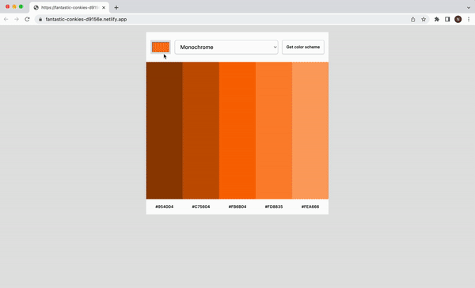

# Color scheme generator

Generate different color schemes

## Features
Users choose a color, a mode and press the button to see the generated color scheme.

## Demo

Test it on Netlify: https://fantastic-conkies-d9156e.netlify.app/

## Technologies
The project is built using:
* HTML
* CSS
* JavaScript
* API

## Technical details
* Used API to fetch the color schemes.
* Used JavaScript to render the colors.

## Room for improvement
* Add an option to copy hex code to clipboard on click.

## Project status
The project is complete.

## Acknowledgements
Color scheme generator is a solo project that was part of [the Frontend Developer Career Path at Scrimba](https://scrimba.com/learn/frontend).

## Contact
Created by [Natalia Davtyan](https://github.com/nataliadavtyan)